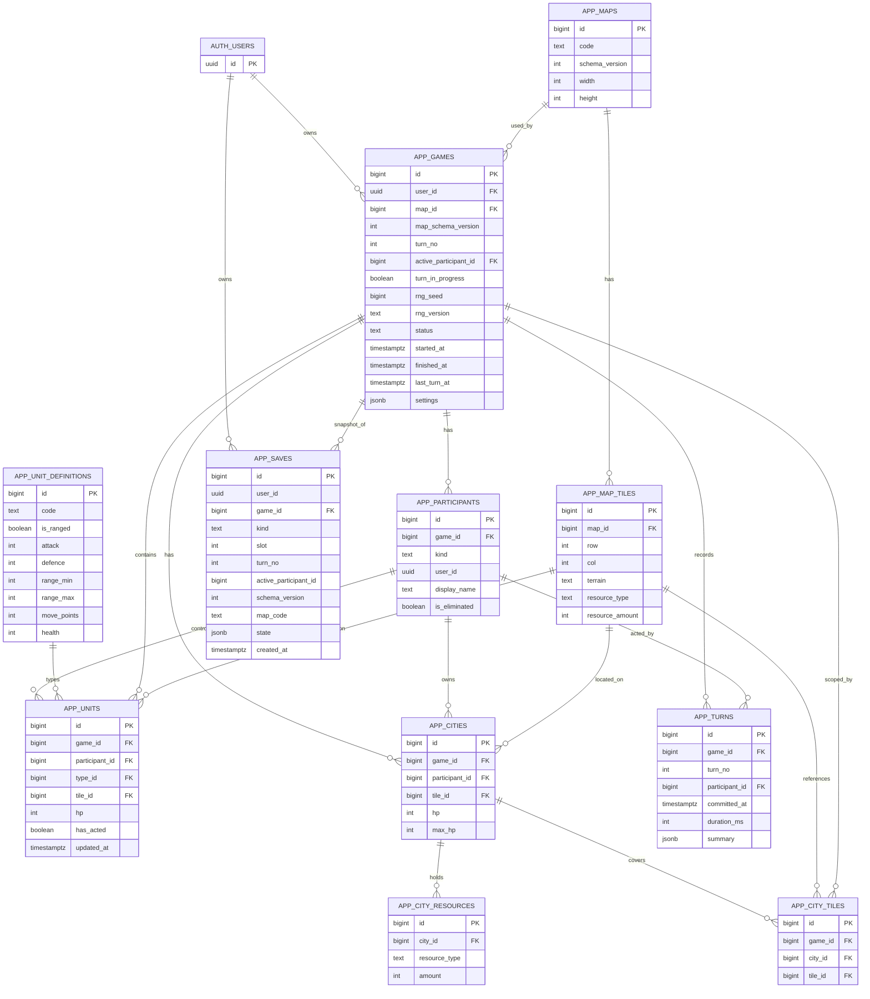

1. List of tables with their columns, data types, and constraints

- Schema notes
  - Use schemas: `auth` (ASP.NET Identity) and `app` (game data).
  - All timestamps use `timestamptz` with `DEFAULT now()` unless noted.
  - Primary keys are `bigint generated always as identity` except `auth.users.id` (`uuid v7`, generated in app).

- auth.users (managed by ASP.NET Identity; referenced here)
  - `id uuid primary key` (uuid v7 generated in application)

- app.maps
  - `id bigint primary key`
  - `code text not null unique`
  - `schema_version int not null`
  - `width int not null`
  - `height int not null`

- app.map_tiles
  - `id bigint primary key`
  - `map_id bigint not null references app.maps(id)`
  - `row int not null`
  - `col int not null`
  - `terrain text not null`
  - `resource_type text null`
  - `resource_amount int not null default 0`
  - Constraints: `unique (map_id, row, col)`

- app.games
  - `id bigint primary key`
  - `user_id uuid not null references auth.users(id) on delete cascade`
  - `map_id bigint not null references app.maps(id)`
  - `map_schema_version int not null`
  - `turn_no int not null default 1`
  - `active_participant_id bigint null references app.participants(id) deferrable initially deferred`
  - `turn_in_progress boolean not null default false`
  - `rng_seed bigint not null`
  - `rng_version text not null default 'v1'`
  - `status text not null default 'active'`  -- values enforced in app
  - `started_at timestamptz not null default now()`
  - `finished_at timestamptz null`
  - `last_turn_at timestamptz null`
  - `settings jsonb not null default '{}'`

- app.participants
  - `id bigint primary key`
  - `game_id bigint not null references app.games(id) deferrable initially deferred`
  - `kind text not null`  -- 'human' | 'ai' (validated in app)
  - `user_id uuid null`   -- set for human; null for AI (validated in app)
  - `display_name text not null`
  - `is_eliminated boolean not null default false`

- app.unit_definitions
  - `id bigint primary key`
  - `code text not null unique`  -- e.g., 'warrior', 'slinger'
  - `is_ranged boolean not null`
  - `attack int not null`
  - `defence int not null`
  - `range_min int not null`
  - `range_max int not null`
  - `move_points int not null`
  - `health int not null`  -- max HP

- app.units
  - `id bigint primary key`
  - `game_id bigint not null references app.games(id) deferrable initially deferred`
  - `participant_id bigint not null references app.participants(id)`
  - `type_id bigint not null references app.unit_definitions(id)`
  - `tile_id bigint not null references app.map_tiles(id)`
  - `hp int not null`
  - `has_acted boolean not null default false`
  - `updated_at timestamptz not null default now()`
  - Constraints: `unique (game_id, tile_id)` -- 1UPT

- app.cities
  - `id bigint primary key`
  - `game_id bigint not null references app.games(id) deferrable initially deferred`
  - `participant_id bigint not null references app.participants(id)`
  - `tile_id bigint not null references app.map_tiles(id)`
  - `hp int not null`
  - `max_hp int not null`

- app.city_tiles
  - `id bigint primary key`
  - `game_id bigint not null references app.games(id) deferrable initially deferred`
  - `city_id bigint not null references app.cities(id)`
  - `tile_id bigint not null references app.map_tiles(id)`
  - Constraints: `unique (game_id, city_id, tile_id)`  -- includes the city tile itself

- app.city_resources
  - `id bigint primary key`
  - `city_id bigint not null references app.cities(id)`
  - `resource_type text not null`
  - `amount int not null default 0`
  - Constraints: `unique (city_id, resource_type)`

- app.saves
  - `id bigint primary key`
  - `user_id uuid not null`  -- duplicate of game owner for convenience
  - `game_id bigint not null references app.games(id) deferrable initially deferred`
  - `kind text not null`  -- 'manual' | 'autosave' (validated in app)
  - `slot int null`       -- 1..3 for manual; null for autosave
  - `turn_no int not null`
  - `active_participant_id bigint not null`
  - `schema_version int not null`
  - `map_code text not null`
  - `state jsonb not null`
  - `created_at timestamptz not null default now()`
  - Constraints:
    - `check (kind <> 'manual' or (slot between 1 and 3))`
    - Partial unique: manual slots `unique (user_id, game_id, slot) where kind = 'manual'`

- app.turns
  - `id bigint primary key`
  - `game_id bigint not null references app.games(id) deferrable initially deferred`
  - `turn_no int not null`
  - `participant_id bigint not null references app.participants(id)`
  - `committed_at timestamptz not null default now()`
  - `duration_ms int null`
  - `summary jsonb null`
  - Constraints: `unique (game_id, turn_no)`

- app.analytics_events (outside RLS)
  - `id bigint primary key`
  - `event_type text not null`
  - `occurred_at timestamptz not null default now()`
  - `game_key bigint not null`         -- copy of games.id; no FK
  - `user_key char(64) not null`       -- salted hash of user_id
  - `salt_version int not null`
  - `turn_no int null`
  - `map_code text null`
  - `map_schema_version int null`
  - `rng_seed bigint null`
  - `game_started_at timestamptz null`
  - `game_finished_at timestamptz null`
  - `participant_count int null`
  - `client_request_id uuid null`
  - Constraints:
    - Partial unique: `unique (client_request_id) where client_request_id is not null`

- app.settings
  - `id bigint primary key`
  - `analytics_salt bytea not null`
  - `salt_version int not null`
  - `updated_at timestamptz not null default now()`

2. Relationships between tables

- `auth.users (1) — (N) app.games` via `games.user_id`.
- `app.maps (1) — (N) app.map_tiles` via `map_tiles.map_id`.
- `app.maps (1) — (N) app.games` via `games.map_id`.
- `app.games (1) — (N) app.participants` via `participants.game_id`.
- `app.participants (1) — (N) app.units` via `units.participant_id`.
- `app.unit_definitions (1) — (N) app.units` via `units.type_id`.
- `app.games (1) — (N) app.units` via `units.game_id`.
- `app.map_tiles (1) — (N) app.units` via `units.tile_id`.
- `app.games (1) — (N) app.cities` via `cities.game_id`.
- `app.participants (1) — (N) app.cities` via `cities.participant_id`.
- `app.map_tiles (1) — (N) app.cities` via `cities.tile_id`.
- `app.cities (1) — (N) app.city_tiles` via `city_tiles.city_id`.
- `app.map_tiles (1) — (N) app.city_tiles` via `city_tiles.tile_id`.
- `app.games (1) — (N) app.city_tiles` via `city_tiles.game_id`.
- `app.cities (1) — (N) app.city_resources` via `city_resources.city_id`.
- `app.games (1) — (N) app.saves` via `saves.game_id`; `auth.users (1) — (N) app.saves` via `saves.user_id`.
- `app.games (1) — (N) app.turns` via `turns.game_id`; `app.participants (1) — (N) app.turns` via `turns.participant_id`.
- `app.games (1) — (1) app.games.active_participant_id → app.participants(id)` (nullable FK, deferrable).

3. Indexes

- Primary keys on all `id` columns (implicit unique btree indexes).
- `app.maps(code)` unique.
- `app.map_tiles(map_id, row, col)` unique.
- `app.units(game_id, tile_id)` unique (1UPT).
- `app.city_tiles(game_id, city_id, tile_id)` unique.
- `app.city_resources(city_id, resource_type)` unique.
- `app.saves(user_id, game_id, slot)` unique where `kind = 'manual'` (partial unique index).
- `app.turns(game_id, turn_no)` unique.
- `app.analytics_events(client_request_id)` unique where `client_request_id is not null` (partial unique index).

4. PostgreSQL policies (if applicable)

- Helper GUC-backed function
  - Create `app.current_user_id()` to read the per-transaction user context:
    ```sql
    create or replace function app.current_user_id()
    returns uuid language sql stable as $$
      select current_setting('app.user_id', true)::uuid
    $$;
    ```
  - Application sets `SET LOCAL app.user_id = '<uuid>'` at the start of each request transaction.

- Enable RLS on `app.games` and child tables (exclude `maps`, `map_tiles`, `unit_definitions`, `analytics_events`, `settings`).

- app.games
  - Enable: `alter table app.games enable row level security;`
  - Policy:
    ```sql
    create policy games_owner_isolation on app.games
      using (user_id = app.current_user_id())
      with check (user_id = app.current_user_id());
    ```

- app.participants, app.units, app.cities, app.city_tiles, app.city_resources, app.saves, app.turns
  - Enable: `alter table app.<table> enable row level security;`
  - Policy pattern (per table):
    ```sql
    create policy by_game_ownership on app.<table>
      using (exists (
        select 1 from app.games g
        where g.id = <table>.game_id
          and g.user_id = app.current_user_id()
      ))
      with check (exists (
        select 1 from app.games g
        where g.id = <table>.game_id
          and g.user_id = app.current_user_id()
      ));
    ```

- Notes
  - `analytics_events` has RLS disabled (intentionally) and no FKs to user/game to allow retention after deletions.
  - Use an admin role with `BYPASSRLS` only for maintenance procedures (purges, account deletion).

5. Additional notes or explanations regarding design decisions

- Identity tables live in `auth` schema (no RLS); game data in `app` schema (RLS-enabled).
- Most gameplay validations (radius, siege, spawning, one human per game, participants.kind semantics) are enforced in the application.
- `active_participant_id` is nullable to avoid circular inserts; set immediately after creating participants (FK is DEFERRABLE to aid snapshot restore).
- Saves are snapshots derived from normalized tables; manual slots (1..3) constraint enforced by partial unique index; autosave ring buffer and dedupe logic handled in the application.
- Analytics are retained after account deletion; `user_key` is a salted hash (salt stored in `app.settings`).
- Minimal indexing policy for MVP: only PK/UNIQUE (including partial unique indexes above). Add secondary indexes later based on profiling.

6. Database schema as a mermaid diagram



