<authentication_analysis>
1) Authentication flows
- SPA bootstrap obtains CSRF cookie before protected writes.
- Email/password login issues Identity session cookie, sets CSRF, redirects.
- Registration creates user, signs in, triggers verify email modal.
- Forgot password and resend verification submit unsigned actions with generic replies.
- Keepalive extends authenticated session; idle timeout raises session-expired modal.
- Auth-guarded pages call APIs; 401/403 redirects to login with returnUrl.
- Logout clears session cookie via server and returns to public routes.

2) Actors and interactions
- Browser: user navigation, stores cookies, handles redirects.
- Client (SPA): React app, forms, fetch wrappers, CSRF provider, guards.
- Server: ASP.NET Identity endpoints, anti-forgery, session issuance, rate limits.
- Postgres: Identity store for users, password hashes, tokens.

3) Token verification and refreshing
- Server validates anti-forgery token on POST/PUT/DELETE; client refreshes via GET /v1/auth/csrf.
- Session cookie verified on every authenticated request; keepalive reissues cookie.
- CSRF refresh after 403 CSRF_INVALID once; failure causes redirect to login.
- Password reset and email confirmation tokens generated by Identity, pending email delivery.

4) Step descriptions
- Initial load: client ensures CSRF cookie, queries auth status.
- Login: client submits credentials with CSRF header; server validates, signs in, sets cookie.
- Registration: server checks duplicates, creates user, signs in, returns 204.
- Verify email: client can resend confirmation token; server logs token.
- Forgot password: server issues reset token; response always 204.
- Guarded fetch: client calls API; on 401 redirects to login preserving returnUrl.
- Keepalive: idle prompt triggers server session refresh or reports unauthorized.
- Idle expiry: session missing → modal instructs login; redirect to /login.
- Logout: client posts with CSRF, server signs out and clears cookie.

```mermaid
sequenceDiagram
autonumber
participant Browser
participant Client
participant Server
participant Postgres

activate Browser
Browser->>Client: Load SPA bundle
deactivate Browser

activate Client
Client->>Server: GET csrf token
activate Server
Server->>Server: Generate antiforgery pair
Server-->>Client: 204 Set cookie
deactivate Server

Client->>Server: GET auth status
activate Server
Server-->>Client: 401 unauthenticated
deactivate Server

Client-->>Browser: Render public view
deactivate Client

activate Browser
Browser->>Client: Submit login form
deactivate Browser

activate Client
Client->>Server: POST login + csrf header
activate Server
Server->>Postgres: Fetch user by email
activate Postgres
Postgres-->>Server: User record + hash
deactivate Postgres
Server->>Server: Verify password, issue session
Server-->>Client: 204 Set auth cookie
deactivate Server

Client-->>Browser: Redirect to returnUrl

activate Browser
Browser->>Client: Navigate to hub
deactivate Browser

activate Client
Client->>Server: GET games for guard
activate Server
Server->>Postgres: Query games by user
activate Postgres
Postgres-->>Server: Game summary
deactivate Postgres
Server-->>Client: 200 OK
deactivate Server
Client-->>Browser: Show hub

par Idle keepalive
  Client->>Server: GET keepalive
  activate Server
  Server->>Server: Extend session expiry
  Server-->>Client: 204 Session refreshed
  deactivate Server
and Session expiry
  Client->>Server: Auth request after idle
  activate Server
  Server-->>Client: 401 session expired
  deactivate Server
  Client-->>Browser: Show session expired modal
  Browser->>Client: Confirm re-login
end

alt CSRF failure on action
  Client->>Server: POST game action + csrf
  activate Server
  Server-->>Client: 403 csrf invalid
  deactivate Server
  Client->>Server: GET csrf token
  activate Server
  Server-->>Client: 204 Set cookie
  deactivate Server
  Client->>Server: Retry action with new token
  activate Server
  Server-->>Client: 200 success
  deactivate Server
else CSRF refresh fails
  Client->>Server: Retry action with new token
  activate Server
  Server-->>Client: 401 unauthorized
  deactivate Server
  Client-->>Browser: Redirect to login with returnUrl
end

alt Registration flow
  Browser->>Client: Submit registration form
  Client->>Server: POST register + csrf
  activate Server
  Server->>Postgres: Check existing email
  activate Postgres
  Postgres-->>Server: No duplicate
  deactivate Postgres
  Server->>Postgres: Insert user + hash
  activate Postgres
  Postgres-->>Server: Inserted
  deactivate Postgres
  Server->>Server: Sign in new user
  Server-->>Client: 204 Set auth cookie
  deactivate Server
  Client-->>Browser: Show verify email modal
end

alt Forgot password
  Browser->>Client: Submit reset request
  Client->>Server: POST forgot password
  activate Server
  Server->>Postgres: Lookup email
  activate Postgres
  Postgres-->>Server: User or null
  deactivate Postgres
  Server->>Server: Generate reset token
  Server-->>Client: 204 generic response
  deactivate Server
  Client-->>Browser: Confirm email sent
end

alt Logout
  Browser->>Client: Click logout
  Client->>Server: POST logout + csrf
  activate Server
  Server->>Server: Sign out session
  Server-->>Client: 204 clear cookie
  deactivate Server
  Client-->>Browser: Redirect to public page
end

Client-->>Browser: Session continues with cookies
```

</authentication_analysis>

<mermaid_diagram>

</mermaid_diagram>

