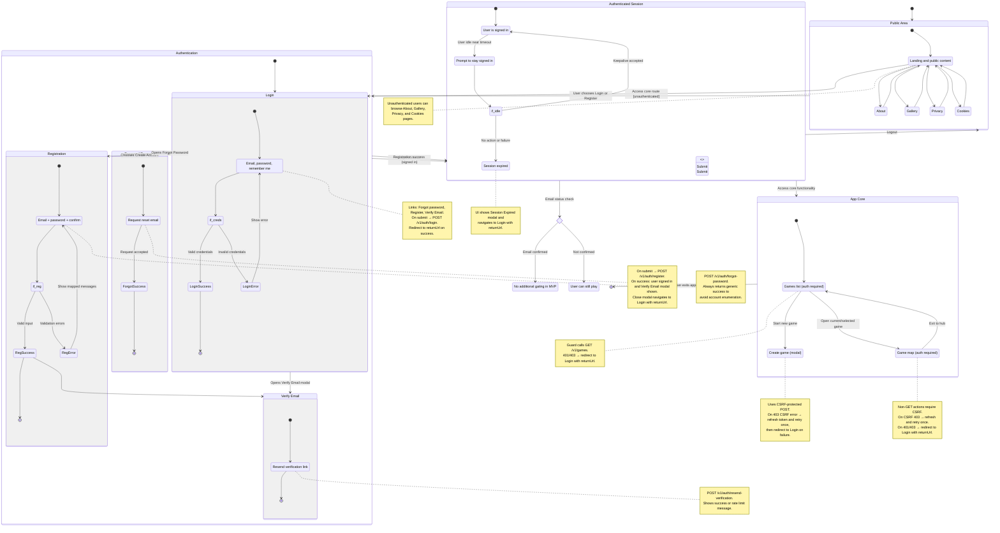

<user_journey_analysis>
1) User flows
- Browse public pages (About, Gallery, Privacy, Cookies)
- Attempt to access game routes while unauthenticated → redirect to Login with returnUrl
- Register a new account → signed in, verify email modal, optional resend verification
- Log in with email/password → redirect to returnUrl
- Forgot password request → generic success, await email link (reset flow TBD)
- Resend verification email (from modal or login) → generic success
- Keep session alive on idle prompt → keepalive; session may expire and require re-login
- Logout → return to public area

2) Main journeys and states
- Public Area: Home/Landing, About, Gallery, Privacy, Cookies
- Authentication: Login, Registration, Password Recovery, Verify Email (resend)
- Authenticated Session: Active, Idle Warning, Expired
- App Core (Authenticated): Hub (games list), New Game, Game Map

3) Decision points and alternative paths
- Credentials valid? → Success (redirect) vs Error (stay on Login)
- Registration valid? → Signed-in + Verify modal vs Validation errors
- Email verified? → Verified vs Unverified (can still play in current impl)
- CSRF valid? → OK vs Refresh CSRF and retry once; then redirect to Login on failure
- Idle action? → User chooses to stay signed in (keepalive) vs do nothing (session expiry)
- Access control? → If unauthenticated, guard redirects to Login with returnUrl

4) State purposes
- Public.Home: Entry point; links to Login/Register; public content access
- Auth.Login.LoginForm: Collect credentials; links to Forgot/Verify/Register
- Auth.Registration.RegisterForm: Create account; on success shows VerifyEmail modal; user is signed in
- Auth.PasswordRecovery.ForgotForm: Request reset; always shows success message (no enumeration)
- Auth.VerifyEmail.Resend: Trigger verification email resend; generic success
- Session.Active: User is authenticated; can access Hub/Game
- Session.IdleWarning: Prompt to keep session alive via keepalive
- Session.Expired: Session ended; modal offers re-login with returnUrl
- Core.Hub: Authenticated hub; lists games; guards against unauth access
- Core.NewGame: Start new game (modal); requires CSRF for POST
- Core.Game: Game map; CSRF refresh on 403, redirect to Login on failure
</user_journey_analysis>

<mermaid_diagram>

</mermaid_diagram>

