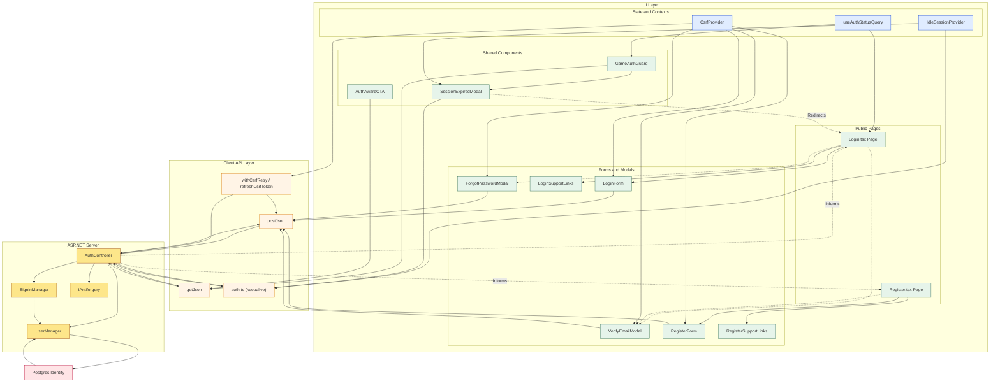

Here is the **English translation** of your `<architecture_analysis>` and Mermaid diagram block:

---

<architecture_analysis>

1. **List of Components**

* `Login.tsx`, `Register.tsx`, `GameAuthGuard.tsx`, `GameCurrentGuardRoute.tsx`
* Form components: `LoginForm`, `RegisterForm`, `ForgotPasswordModal`, `VerifyEmailModal`
* Support components: `LoginSupportLinks`, `RegisterSupportLinks`, `AuthAwareCTA`
* State providers: `CsrfProvider`, `IdleSessionProvider`, hook `useAuthStatusQuery`
* API layer: `postJson`, `getJson`, modules `auth.ts`, `csrf.ts`
* Server controller: `AuthController` with actions for CSRF, login, register, logout, keepalive, forgot, resend

2. **Main Pages and Their Components**

* `Login.tsx` renders `LoginForm`, `LoginSupportLinks`, and the recovery/verification modals
* `Register.tsx` renders `RegisterForm`, `RegisterSupportLinks`, and `VerifyEmailModal`
* Game pages use `GameAuthGuard` and session-dependent start modals

3. **Data Flow Between Components**

* Forms delegate validation to Zod and call `postJson` with a CSRF header
* Upon success, the client invalidates the `auth-status` query (React Query) and redirects
* `CsrfProvider` and `withCsrfRetry` handle token refresh before mutating requests
* The server controller uses ASP.NET Identity and communicates with Postgres via `UserManager`
* `IdleSessionProvider` and the `SessionExpiredModal` respond to 401/idle events

4. **Component Function Descriptions**

* `LoginForm`: collects login data, validates, and sends request
* `RegisterForm`: handles registration and maps error codes to messages
* `ForgotPasswordModal`: sends reset request and shows success state
* `VerifyEmailModal`: allows resending of confirmation link
* `CsrfProvider`: initializes and refreshes the XSRF cookie, exposes context status
* `IdleSessionProvider`: monitors user inactivity and triggers keepalive
* `AuthController`: handles authentication, registration, session refresh, and logout

</architecture_analysis>

---

<mermaid_diagram>

</mermaid_diagram>
